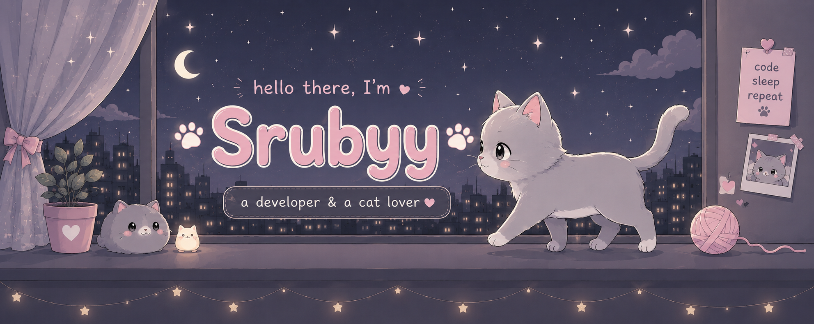
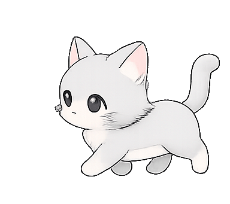
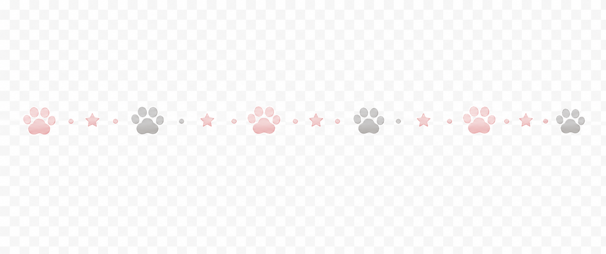
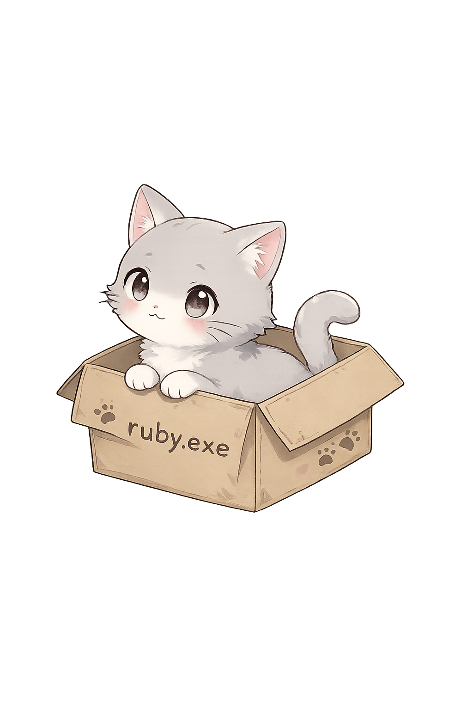
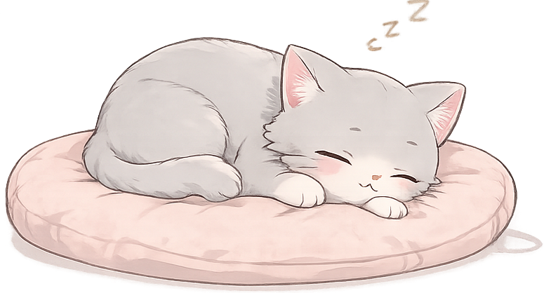
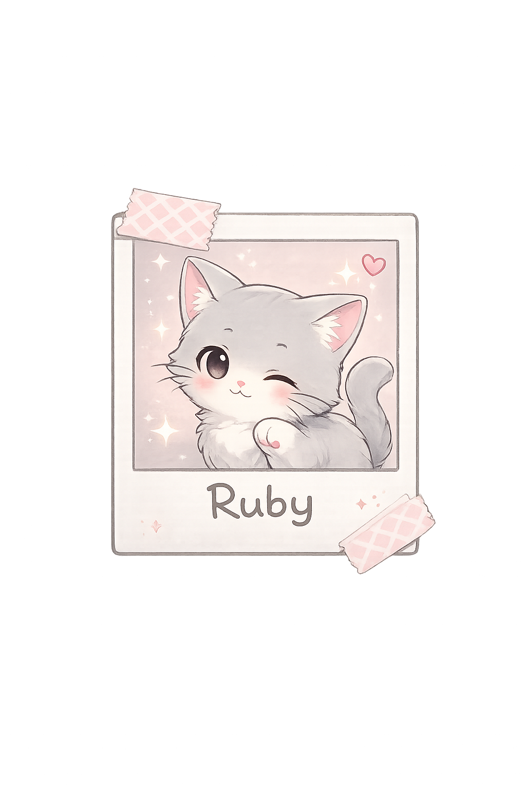

  

<h1>🐾 Hello there, I'm Sruti Baliga 🐾</h1>

<h3>✨ Computer Engineering Student • Developer • Cat Lover ✨</h3>

 

 

<h1>🌸 About Me 🌸</h1>

<table>
<tr>

<td align="center" width="35%">

</td>

<td align="left" width="65%">

💗 Computer Engineering Student

💻 Full Stack & IoT Enthusiast

☕ Powered by coffee and late-night debugging

🌸 Currently exploring AI & Cloud Computing

🐱 Professional cat enthusiast

✨ Turning ideas into projects, one commit at a time.

</td>

</tr>
</table>

 

 

<h1>💻 Tech Stack</h1>

 

 

 

<h1>📊 GitHub Stats</h1>

  

 

  
  &nbsp;&nbsp;
  

 

 

<h1>🌱 Currently Exploring</h1>

 

<table align="center" border="0" cellpadding="0" cellspacing="0" style="border-collapse: collapse; border: none !important; background: transparent;">
<tr style="border: none !important; background: transparent;">

<!-- Left Column: Cute Status Badges -->
<td align="left" valign="middle" style="padding-right: 40px; border: none !important; background: transparent; line-height: 2;">
  
🌸 <b>Full Stack Development</b>

  
☁️ <b>Cloud Computing</b>

  
🤖 <b>Artificial Intelligence</b>

  
📱 <b>Mobile App Development</b>

  
🚀 <b>Open Source</b>

</td>

<!-- Right Column: Snuggly Sleeping Cat Image right next to the text -->
<td align="center" valign="middle" style="border: none !important; background: transparent;">
  
</td>

</tr>
</table>

 

<h1>📫 Connect With Me</h1>

&nbsp;

&nbsp;

 

<h3>💖 Thanks for visiting my profile!</h3>

 

